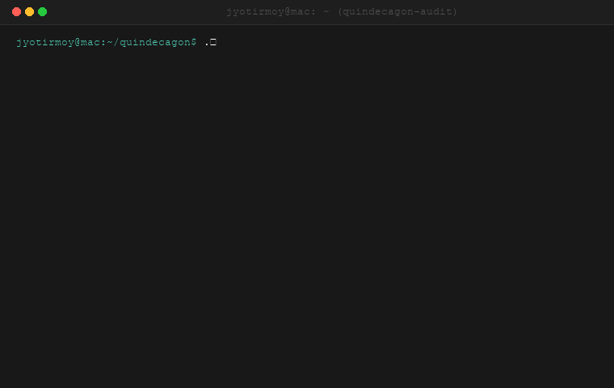

# quindecagon: Clinical Pipeline Integrity & Security Framework

[](https://github.com/JD2112/quindecagon/actions/workflows/ci.yml)
[](CHANGELOG.md)
[](LICENSE)
[](docs/checkers.md)
[](#-security-checks)
[](https://www.nextflow.io/)
[](Dockerfile)
[](https://doi.org/10.5281/zenodo.20590853)
[](https://github.com/JD2112/quindecagon/actions/workflows/publish-pypi.yml)

#### **Supported Security & Compliance Scanners (15-in-1 Suite):**
[](https://nf-co.re/)
[](https://flake8.pycqa.org/)
[](https://black.readthedocs.io/)
[](https://lintr.r-lib.org/)
[](https://semgrep.dev/)
[](https://bandit.readthedocs.io/)
[](https://github.com/stephaniehicks/oysteR)
[](https://github.com/anchore/syft)
[](https://github.com/sigstore/cosign)
[](https://trivy.dev/)
[](https://snyk.io/)
[](https://github.com/anchore/grype)
[](https://docs.docker.com/scout/)
[](https://gitleaks.io/)
[](https://github.com/pharmaR/riskmetric)


<p align="center">
  
</p>

**quindecagon** is a specialized security and compliance audit framework designed specifically for clinical Nextflow pipelines. By leveraging 15 distinct security and quality-assurance instruments, quindecagon ensures that your bioinformatics workflows are deterministic, secure, and ready for clinical validation.

### Why quindecagon?

In a clinical setting (CAP/CLIA/HIPAA), pipeline stability is not optional. **quindecagon** provides an automated, "defense-in-depth" validation gate that runs before any patient data is processed. It effectively eliminates the "silent drift" of container versions and prevents the introduction of insecure code or hardcoded credentials into the diagnostic environment.

### The 15 Faces of Security

**quindecagon** synthesizes outputs from the following 15 essential tools to provide a holistic, clinical-grade view of pipeline health:

#### **Code Quality & Linting**

* **[nf-core lint](https://www.google.com/search?q=https://nf-co.re/tools/)**: Ensures the pipeline adheres to the nf-core community's best practices and standardized structure.
* **[Flake8](https://flake8.pycqa.org/)**: Checks custom Python scripts for syntax errors, PEP 8 styling, and undefined variables.
* **[Black](https://black.readthedocs.io/)**: An uncompromising, deterministic Python code formatter to ensure style consistency.
* **[lintr](https://lintr.r-lib.org/)**: Performs static analysis on R code to enforce styling and detect potential syntax errors.

#### **Static Analysis (SAST)**

* **[Semgrep](https://semgrep.dev/)**: Analyzes Groovy/Nextflow source code to find security vulnerabilities and configuration bugs.
* **[Bandit](https://bandit.readthedocs.io/)**: Scans custom Python scripts for security anti-patterns and insecure library usage.
* **[oysteR](https://www.google.com/search?q=https://github.com/stephaniehicks/oysteR)**: Audits R package dependencies against the Sonatype OSS Index for known vulnerabilities.

#### **Supply Chain Integrity**
* **[Syft](https://github.com/anchore/syft)**: Generates a comprehensive Software Bill of Materials (SBOM) for container images.
* **[Cosign](https://github.com/sigstore/cosign)**: Handles container signing, verification, and provenance storage in OCI registries.

#### **Vulnerability Consensus**
* **[Trivy](https://www.google.com/search?q=https://aquasecurity.github.io/trivy/)**: Scans container images, file systems, and repositories for vulnerabilities.
* **[Snyk](https://snyk.io/)**: Scans container images for vulnerabilities in application dependencies and base-image packages.
* **[Grype](https://github.com/anchore/grype)**: Specializes in SBOM-based vulnerability scanning for container images and filesystems.
* **[Docker Scout](https://docs.docker.com/scout/)**: Provides integrated analysis of container images to identify and remediate security vulnerabilities.

#### **Secrets & Risk Management**
* **[Gitleaks](https://gitleaks.io/)**: Scans repositories for leaked API keys, tokens, and hardcoded credentials.
* **[riskmetric](https://github.com/pharmaR/riskmetric)**: Provides a quantitative framework for evaluating the risk associated with R package dependencies.

### Clinical Compliance Mapping

quindecagon maps its automated checks directly to regulatory requirements, providing laboratory directors with the verifiable documentation required for clinical accreditation:

* **CAP NGS Checklist**: Validates software integrity, component provenance, and reproducibility.
* **HIPAA Security Rule**: Ensures risk analysis, data integrity, and transmission security.

## Quick Start

### Option A: Run directly (tools installed locally)

```bash
# Clone the security suite
git clone https://github.com/JD2112/quindecagon.git
cd quindecagon

# Run against your pipeline directory
./run_all_checks.sh /path/to/your/nextflow-pipeline
```

### Option B: Run via Docker (recommended)

Use the built-in, zero-configuration runner script to automatically build, mount, and run checks:

```bash
# Run against a pipeline directory on your host
./quindecagon/scripts/docker_run.sh /path/to/your/nextflow-pipeline
```

> **Security Note:** Mounting `/var/run/docker.sock` allows the container to communicate with the host's Docker daemon. While this is necessary for `quindecagon` to auto-discover and scan your pipeline's running containers, you should only run the container in environments you trust, as mounting the Docker socket grants the container root-level control over the host's Docker daemon.

### Option C: Native Continuous Integration (GitHub Actions)

Add Quindecagon auditing and live Shields.io badges to any Nextflow repository.

#### Using the CLI (Automated Setup)

Install `quindecagon` and run `init-ci` in your pipeline repository:

```bash
# Install Quindecagon
pip install quindecagon
# (or directly from GitHub: pip install git+https://github.com/JD2112/quindecagon.git)
# (or run without installing via: pipx run quindecagon init-ci)

# Navigate to your Nextflow pipeline repo
cd /path/to/your-pipeline

# Generate workflow & automatically inject dynamic badges into README.md
quindecagon init-ci
# or
quindecagon workflow create
```

#### Zero-Install Setup (Manual Copy-Paste)

If you prefer **not to install anything locally**, you can simply create `.github/workflows/quindecagon-audit.yml` directly in your repo:

```yaml
name: Security & Compliance Audit

on:
  push:
    branches: [main, dev]
  pull_request:
    branches: [main, dev]
  workflow_dispatch:

permissions:
  contents: write

jobs:
  quindecagon-audit:
    name: 'Quindecagon Audit'
    uses: JD2112/quindecagon/.github/workflows/pipeline-audit.yml@main
    permissions:
      contents: write
    with:
      deploy-badges: true
```

Whenever commits land on `main` or `dev`, Quindecagon executes inside `jd21/quindecagon:0.4.0`, produces audit artifacts, and publishes updated JSON endpoints to the pipeline's `badges` branch for dynamic Shields.io display.


## Usage

```
./quindecagon/scripts/docker_run.sh [skip-options] <TARGET_DIR>
```

| Argument          | Required | Description                                                |
|-------------------|----------|------------------------------------------------------------|
| `TARGET_DIR`      | ✅       | Path to the Nextflow pipeline directory to audit           |

> **Auto-Discovery:** Container images are automatically parsed from your pipeline's
> `nextflow.config`, `conf/*.config`, and `*.nf` files. You never need to list them manually.

### Dynamic Skip Options (Fine-Grained Auditing)

You can selectively bypass one or more of the 15 audit checkers by passing `--skip-<tool>` CLI flags. Skipped tools are cleanly logged as warnings and reported as `Skipped` directly inside final HTML/PDF dashboards without halting the validation suite:

```bash
# Example: Skip heavy container consensus scanners (Snyk/Docker Scout)
./quindecagon/scripts/docker_run.sh --skip-snyk --skip-docker-scout /path/to/your/nextflow-pipeline

# Example: Skip static checkers to only run reproducibility and signature verification
./quindecagon/scripts/docker_run.sh --skip-semgrep --skip-bandit --skip-r-audit /path/to/your/nextflow-pipeline
```

#### Available Skip Flags:
* **Container Security:** `--skip-trivy`, `--skip-snyk`, `--skip-docker-scout`, `--skip-syft` *(skips SBOM)*, `--skip-grype`, `--skip-cosign`
* **Static Analysis (SAST):** `--skip-gitleaks`, `--skip-semgrep`, `--skip-bandit`, `--skip-r-audit` *(skips R checkers)*
* **Quality & Style Linters:** `--skip-flake8`, `--skip-black`, `--skip-nfcore-lint`
* **Validation Gates:** `--skip-nf-config`, `--skip-reproducibility`

### Zero-Configuration Cosign Key Mounting

When verifying cryptographic provenance, the framework automatically searches for a Cosign public key on your Mac host in this order of precedence:
1. Environment variable `COSIGN_PUBLIC_KEY`
2. Secret `.env` file parameter `COSIGN_PUBLIC_KEY`
3. Default path `~/.cosign/cosign.pub`
4. Current directory `cosign.pub`

If found, it is securely mounted as `/app/cosign.pub:ro` inside the container sandbox. The container's Cosign engine (**v3.0.6**) will then execute matching host-level signature verifications out-of-the-box.

### What happens at startup

```
========================================
Target pipeline:  /target
Reports saved to: /app/reports/your-pipeline_2026-04-30_09-20
========================================
Auto-discovered 15 container images:
   • quay.io/biocontainers/multiqc:1.33--pyhdfd78af_0
   • ...
========================================
```

---

## Security Checks

The suite runs **13 automated checks** across code quality, bioinformatic scripts security, container security, and supply chain integrity:

| #  | Check                    | Tool                  | What it does                                            |
|----|--------------------------|-----------------------|---------------------------------------------------------|
| 1  | Pipeline Linting         | `nf-core lint`        | Validates pipeline structure against nf-core standards  |
| 2  | Config Validation        | `nextflow config`     | Checks `nextflow.config` syntax and schema              |
| 3  | Static Code Analysis     | Semgrep               | Scans pipeline code for security anti-patterns          |
| 4  | Python Script SAST       | Bandit                | AST-level vulnerability scan for custom Python scripts  |
| 5  | Python Code Quality      | Flake8                | PEP 8 styling, syntax error, and undefined name linting |
| 6  | R Script SAST & SCA      | `lintr` + `oysteR`    | Dangerous R eval/system analysis and OSS Index SCA      |
| 7  | Container CVE Scan       | Trivy                 | Scans container images for known vulnerabilities        |
| 8  | Dependency Scan          | Snyk                  | Deep dependency analysis with CVSS scoring              |
| 9  | Docker Scout             | Docker Scout          | Docker-native CVE + recommendation engine               |
| 10 | SBOM + Vulnerability     | Syft + Grype          | Generates SBOM (SPDX) and scans for vulnerabilities     |
| 11 | Signature Verification   | Cosign                | Verifies container image signatures (Sigstore)          |
| 12 | Reproducibility Audit    | Custom                | Checks for `nextflow.lock` and pinned container digests |
| 13 | Provenance Tracking      | Custom                | Validates manifest definition and execution tracking    |

### Graceful Degradation
Every check is **optional**. If a tool isn't installed, the check is skipped with a `⚠️` warning and a `skipped` status in the JSON report. The remaining checks continue to run.

## Project Structure

```
quindecagon/
├── Dockerfile                  # Hardened Ubuntu 24.04 container with all tools
├── run_all_checks.sh           # Main orchestrator (entry point)
├── config/
│   └── config.env              # Thresholds, image names, scanner settings
├── scripts/
│   ├── run_nfcore_lint.sh      # nf-core lint
│   ├── validate_nextflow_config.sh
│   ├── run_semgrep.sh          # Semgrep static analysis
│   ├── run_bandit.sh           # Bandit Python SAST
│   ├── run_flake8.sh           # Flake8 Python linter
│   ├── run_r_audit.sh          # R lintr & oysteR security scan
│   ├── run_trivy.sh            # Trivy image scan
│   ├── run_snyk.sh             # Snyk container test
│   ├── run_docker_scout.sh     # Docker Scout CVE scan
│   ├── run_syft_grype.sh       # SBOM generation + Grype scan
│   ├── check_cosign.sh         # Cosign signature verification
│   ├── check_reproducibility.sh
│   ├── check_provenance.sh
│   ├── generate_report.sh      # Quarto HTML/PDF report generation
│   └── sign_images.sh          # Batch Cosign signing utility
├── report.qmd                  # Quarto report template
├── cosign.pub                  # Public key for signature verification
└── reports/                    # Generated reports (never in target dir)
    ├── your-pipeline_2026-04-30_08-45/
    │   ├── raw/                #   JSON outputs from each scanner
    │   └── final/              #   Rendered HTML report
    └── your-pipeline_2026-04-30_14-20/
        ├── raw/
        └── final/
```

## Configuration

All settings are in [`config/config.env`](config/config.env):

```bash
# CVSS threshold — fail any check if a vulnerability exceeds this score
CVSS_THRESHOLD=7.0

# Default container image to scan
CONTAINER_IMAGE="your-registry/your-pipeline:1.1.0"

# Cosign public key for signature verification
COSIGN_PUBLIC_KEY="cosign.pub"

# Scanner severity thresholds
GRYPE_SEVERITY_THRESHOLD="high"
DOCKER_SCOUT_THRESHOLD="high"
```

> **Tip:** You can override `CONTAINER_IMAGE` from the command line without editing the config file:
> ```bash
> ./run_all_checks.sh /path/to/your/nextflow-pipeline your-registry/your-pipeline:1.1.0
> ```

### Hardening Features

- **Base Image**: Ubuntu 24.04 LTS with `apt-get upgrade` for latest OS patches
- **No Go Compiler**: Cosign and Snyk are installed as pre-built binaries (not compiled from source), eliminating thousands of transitive Go dependencies
- **Python CVE Patches**: `setuptools` and `wheel` are force-upgraded to patch *CVE-2025-47273* and *CVE-2026-24049*
- **Multi-Architecture**: Automatic detection of `amd64`/`arm64` for native performance on Apple Silicon and Linux

### Environment Variables

| Variable       | Description                              |
|----------------|------------------------------------------|
| `SNYK_TOKEN`   | Required for Snyk authentication         |
| `DOCKER_HOST`  | Set automatically when mounting Docker socket |

## Image Signing

### Sign your images (batch)

```bash
# Edit scripts/sign_images.sh to list your images, then:
./scripts/sign_images.sh
```

The script automatically resolves each image tag to its **immutable SHA256 digest** before signing — this is the production-grade approach recommended by Sigstore.

### Verify a signature

```bash
cosign verify --key cosign.pub your-registry/your-pipeline:1.1.0
```

A successful verification confirms:
- The image was signed by the holder of `cosign.key`
- The image contents have not been tampered with since signing
- The digest matches the exact bytes that were approved

## Reports

Reports are saved inside the **security suite directory** — never inside the target pipeline. Each run creates a unique, timestamped folder namespaced by the pipeline name:

```
quindecagon/reports/
├── your-pipeline_2026-04-30_08-45/     # First audit
│   ├── raw/                         # Individual JSON outputs
│   │   ├── trivy.json
│   │   ├── snyk.json
│   │   ├── grype.json
│   │   ├── semgrep.json
│   │   ├── cosign.json
│   │   ├── reproducibility.json
│   │   ├── provenance.json
│   │   └── ...
│   └── final/
│       └── report.html              # Aggregated HTML dashboard
├── your-pipeline_2026-04-30_14-20/     # Second audit (same day)
│   ├── raw/
│   └── final/
└── enrichment_2026-05-01_09-00/     # Different pipeline
    ├── raw/
    └── final/
```

> **Why?** This prevents accidental overwrites if the target pipeline already has a `reports/` directory (e.g., MultiQC, Nextflow traces). Your pipeline code is never modified by the security scanner.


## License & Attribution
Licensed under the **MIT License**. See [LICENSE](LICENSE) for details.
Developed and maintained by **Jyotirmoy Das**.

## Citations

Das, J. (2026). quindecagon (0.4.0-release). Zenodo. https://doi.org/10.5281/zenodo.20590854

## Acknowledgments

We would like to acknowledge the Core Facility, Faculty of Medicine and Health Sciences, Linköping University, Linköping, Sweden and Clinical Genomics Linköping, Science for Life Laboratory, Sweden for their support.

---

_Developed with ❤️ for Bioinformaticians by a Bioinformatician_