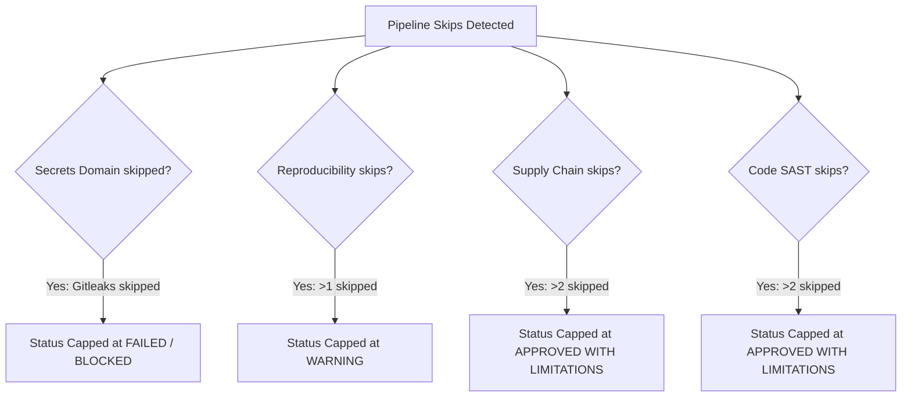

---
hide:
  - navigation
---

# Clinical Security & Compliance Suite

**quindecagon**'s primary purpose is to provide medical laboratory directors, compliance officers, and bioinformatics auditors with a formal, mathematical, and verifiable audit trail. The automated framework groups 15 specialized defensive checkers, maps them to standard molecular pathology checklists, and evaluates findings using a dynamic compliance gatekeeper.

---

## 1. Hardened Security Tools Directory

The following suite is responsible for securing your Software Bill of Materials (SBOM), container bases, script integrity, and preventing credentials exposure in repository history.

### Supply Chain & Container Security (Pillars A & D)

| Tool & Version | Primary Role | Executed CLI Command | License | Remediation Action |
| :--- | :--- | :--- | :--- | :--- |
| **Gitleaks**   `v8.18.2` | Mandated secrets scanning. Searches git commit history and repository metadata to block API tokens, keys, or credentials. | `gitleaks detect --source=/target --redact --verbose` | MIT | Remove hardcoded credentials from repository commit history using BFG Repo-Cleaner or `git filter-branch`. |
| **Trivy**   `v0.55.0` | Container operating system and package vulnerability audit. | `trivy image --severity HIGH,CRITICAL --timeout 15m <img_name>` | Apache 2.0 | Update base image to a secure, minimal distro (e.g., Alpine or distroless) or rebuild with updated system libraries. |
| **Snyk CLI**   `Latest` | Multi-scanner consensus container verification. Serves as a second opinion validator next to Trivy to prevent false negatives. | `snyk container test <img_name> --platform=linux/amd64 --json` | Custom / Commercial | Review Snyk vulnerability databases and patch base image layers. |
| **Docker Scout CLI**   `Latest` | Advanced image SAST and layer vulnerability profiling. | `docker scout cves registry://<img_name> --format sarif` | Commercial / Free Tier | Rebuild layer dependencies or upgrade parent base images. |
| **Syft**   `v1.20.0` | Automatic Software Bill of Materials (SBOM) CycloneDX/SPDX manifest generation. Mandatory under FDA Medical Device Cybersecurity guidelines. | `syft docker:<img_name> --platform linux/amd64 -o spdx-json` | Apache 2.0 | _N/A (Manifest generation engine)_ |
| **Grype**   `v0.88.0` | SBOM vulnerability mapping. Cross-references CycloneDX SBOM lists against local CVE databases. | `grype sbom:<path_to_sbom> --fail-on critical` | Apache 2.0 | Review mapped package vulnerabilities and rebuild/update container image layers. |
| **Cosign**   `v3.0.6` | Supply chain cryptographic signature verification. Confirms that container images are signed and have not been hijacked. | `cosign verify --key cosign.pub <img_name>` | Apache 2.0 | Sign images using `cosign sign` in the build registry workflow. |

### Static Code SAST & Quality Checks (Pillar C)

| Tool & Version | Primary Role | Executed CLI Command | License | Remediation Action |
| :--- | :--- | :--- | :--- | :--- |
| **Semgrep**   `v1.160.0` | Nextflow Groovy/DSL script static analysis. Checks for command injections, insecure bash interpolations, and unsafe scripts. | `semgrep --config auto /target --json` | LGPL-2.1 | Review findings and rewrite unsafe bash interpolations or command-construction statements. |
| **Bandit**   `v1.7.5` | Python utility static security linter. Flags dangerous functions (e.g., `eval`, `subprocess.Popen` with `shell=True`). | `bandit -r /target -f json` | Apache 2.0 | Replace insecure functions with safer standard library alternatives (e.g., `subprocess.run` with list arguments, `ast.literal_eval`). |
| **Flake8**   `v6.0.0` | Python PEP8 styling and syntax sanity checker. | `flake8 /target --format=json` | MIT | Format files using Black or resolve styling inconsistencies manually. |
| **Black**   `v24.0.0` | Python formatting checker to guarantee deterministic, reproducible scripts. | `black --check --diff /target` | MIT | Format the Python scripts with the `black` code formatter. |
| **lintr**   `v3.1.2` | R static analysis linter. Catches unsafe R commands (`eval(parse())`) and memory leakages. | `Rscript -e 'lintr::lint_dir("/target")'` | GPL-3 | Refactor flagged expressions to avoid dynamic parsing and ensure proper scoping of variables. |
| **oysteR**   `v0.1.1` | R/CRAN dependency Software Composition Analysis (SCA). Audits libraries declared in `renv.lock` or `DESCRIPTION` against the Sonatype OSS Index. | `Rscript -e 'oysteR::audit_renv("/target")'` | GPL-2 | Upgrade outdated or compromised libraries to safe patched CRAN releases. |
| **riskmetric**   `v0.2.4` | R CRAN/Bioconductor package maintenance quality and test-coverage scoring. | `Rscript -e 'riskmetric::pkg_ref("/target")'` | MIT | Replace highly abandoned, low-scored community packages with well-maintained, high-coverage packages. |
| **nf-core lint**   `v2.14` | Nextflow workflow best practices linter. Confirms strict pipeline standards are preserved. | `nf-core pipelines lint --dir /target --json` | MIT | Re-align files with nf-core templates and fix missing or misconfigured pipeline config standards. |

---

## 2. Dynamic Decision Gates

**quindecagon** implements a risk-weighted **Clinical Compliance Decision Gatekeeper** that evaluates raw scans and enforces laboratory quality guidelines. Rather than using simple pass/fail flags, it applies a domain-centric hierarchy to output a formal certification status.

### The 4 Clinical Compliance Levels

Every pipeline audit compiles to one of four official validation tiers:

| Compliance Status | Rule & Verification Logic | Clinical Impact & Lab Authority |
| :--- | :--- | :--- |
| Approved | 100% of executed security checks passed with zero `FAILED` markers. (Styling warnings or formatting recommendations are permitted). | Verifiably safe and compliant. Fully authorized for clinical diagnostics and patient report generation under CAP/CLIA validation rules. |
| Approved with Limitations | Exactly one validation check has failed or a non-critical domain skip threshold was exceeded, but all other checkers passed. | Conditional clinical use allowed. Requires a documented **CAPA (Corrective and Preventive Action)** plan filed with the Laboratory Director for the isolated deficiency within 30 days. |
| Warning | More than one checker has failed, or multiple critical checks across domains were bypassed. | Suspended authorization. Disallowed for active patient diagnostics under CAP/CLIA validation rules until a formal Laboratory Director review and manual override are logged. |
| Failed / Blocked | Systemic failure. Bypassing critical security gates (such as hardcoded secrets scanning) or skipping 100% of checks in any single clinical domain. | Immediate pipeline lock. Completely blocked from clinical diagnostics. Represents a severe breach of quality control. |

### Risk-Weighted Skip Overrides

To prevent users from bypassing rigorous security checks under a general skip count, quindecagon enforces strict, domain-specific bypass thresholds:

1.  **Secrets Domain (Zero-Bypass):** Max 0 skips allowed. Bypassing secrets scanning (`Gitleaks`) represents a critical HIPAA data protection breach. The audit is immediately capped at **FAILED / BLOCKED**.
2.  **Workflow Reproducibility (Pillar B):** Max 1 skip allowed. Bypassing more than 1 reproducibility check (e.g. Nextflow configurations or git tags) compromises the pipeline's stability and caps the compliance level at **WARNING**.
3.  **Software Supply Chain & Code SAST (Pillars A & C):** Max 2 skips allowed. Skipping more than 2 tools in either supply chain consensus (`Trivy`, `Snyk`, `Grype`, `Scout`, `Cosign`) or static script checkers (`Semgrep`, `Bandit`, `Flake8`, `R audit`) caps the compliance status at **APPROVED WITH LIMITATIONS**.

*Note: If 100% of active checks within any of the 4 Clinical Pillars are skipped, the framework flags a complete quality-assurance blind spot and immediately downgrades the status to **FAILED / BLOCKED**.*

---

## 3. Clinical Accreditation & Regulatory Compliance Matrix

Our automated checkers map directly to standard pathology requirements and federal data security guidelines:

### College of American Pathologists (CAP) Molecular Pathology NGS Checklist (MOM)

| CAP Checklist Item | Regulatory Standard & Requirement | quindecagon Automated Check & Implementation |
| :--- | :--- | :--- |
| <a href="https://www.cap.org/laboratory-improvement/accreditation/laboratory-accreditation-program" target="_blank">**MOM.36000**</a> | **Nextflow Pipeline Validation, Stability & Determinism**: Requires verification that software versions, reference genomes, and parameters are stable and locked. | **Nextflow Config & Tag Audits (`nf-core lint`)**: Confirms strict container tag/digest usage, locks channels, and prevents the use of dynamic tags (e.g. `latest`) which cause drift. |
| <a href="https://www.cap.org/laboratory-improvement/accreditation/laboratory-accreditation-program" target="_blank">**MOM.36050**</a> | **Software Code Integrity & Development Validation**: Mandates that code additions or updates undergo linting, vulnerability checking, and verification. | **Script SAST & Quality Checks (`Semgrep`, `Bandit`, `Flake8`, `lintr`)**: Audits Python, Nextflow, and R statistics code for anti-patterns and unsafe commands before clinical deployment. |
| <a href="https://www.cap.org/laboratory-improvement/accreditation/laboratory-accreditation-program" target="_blank">**MOM.36100**</a> | **Access Control and Data Isolation Policies**: Requires secure access methods, credential protection, and prevents credentials leaks. | **Secrets Detection (`Gitleaks`)**: Scans full repository commit histories to detect and block hardcoded API keys, server tokens, or SSH keys. |
| <a href="https://www.cap.org/laboratory-improvement/accreditation/laboratory-accreditation-program" target="_blank">**MOM.36120**</a> | **Third-party Library & Package Vulnerability Tracking**: Mandates tracking and validation of CRAN, Bioconductor, and container libraries. | **Supply Chain SCA (`oysteR`, `riskmetric`, `Syft`, `Grype`)**: Generates Software Bill of Materials (SBOM) and audits third-party R/CRAN packages against known advisory lists. |
| <a href="https://www.cap.org/laboratory-improvement/accreditation/laboratory-accreditation-program" target="_blank">**MOM.36150**</a> | **Validation of Software Updates & Security Integrity**: Requires vulnerability auditing and layer checks for clinical container runtimes. | **Multi-Scanner Container Consensus (`Trivy`, `Snyk`, `Docker Scout`)**: Synthesizes OS-level layers and package vulnerability scans in a robust consensus matrix. |
| <a href="https://www.cap.org/laboratory-improvement/accreditation/laboratory-accreditation-program" target="_blank">**MOM.36200**</a> | **Pipeline Component & Provenance Validation**: Requires cryptographic verification of pipeline images to prevent interception. | **Cryptographic Signature Verification (`Cosign`)**: Confirms that container images are signed and matched against local keys before clinical diagnostics runs. |

### HIPAA Security Rule (45 CFR Part 160 & Part 164)

| HIPAA Standard Section | Regulatory Requirement | quindecagon Compliance Role |
| :--- | :--- | :--- |
| <a href="https://www.ecfr.gov/current/title-45/subtitle-A/subchapter-C/part-164/subpart-C/section-164.308#p-164.308(a)(1)(ii)(A)" target="_blank">**§164.308 (a)(1)(ii)(A)**</a> | **Risk Analysis & Vulnerability Management**: Conduct an accurate and thorough assessment of potential risks and vulnerability exposures. | **Container & Code SCA**: Executes multi-engine scans (`Trivy`, `Snyk`, `Grype`, `Semgrep`, `Bandit`) to locate CVEs and security flaws. |
| <a href="https://www.ecfr.gov/current/title-45/subtitle-A/subchapter-C/part-164/subpart-C/section-164.308#p-164.308(a)(1)(ii)(B)" target="_blank">**§164.308 (a)(1)(ii)(B)**</a> | **Risk Mitigation & Control Implementation**: Implement security measures sufficient to reduce risks and vulnerabilities to a reasonable level. | **Dynamic Decision Gates & Capping**: Enforces risk-weighted bypass overrides and completeness caps, blocking deployment of compromised pipelines. |
| <a href="https://www.ecfr.gov/current/title-45/subtitle-A/subchapter-C/part-164/subpart-C/section-164.308#p-164.308(a)(4)" target="_blank">**§164.308 (a)(4)**</a> | **Information Access Management**: Ensure protected health information (ePHI) access is restricted. | **Active Secrets Scanning**: Blocks AWS/Database credential leakage inside code repositories, preventing unauthorized data exfiltration routes. |
| <a href="https://www.ecfr.gov/current/title-45/subtitle-A/subchapter-C/part-164/subpart-C/section-164.308#p-164.308(a)(8)" target="_blank">**§164.308 (a)(8)**</a> | **Technical Security Evaluation**: Perform periodic technical evaluations of security controls. | **Audit Trail Logging & Quarto PDFs**: Generates deterministic PDF certificates and HTML cockpit reports, establishing immutability. |
| <a href="https://www.ecfr.gov/current/title-45/subtitle-A/subchapter-C/part-164/subpart-C/section-164.312#p-164.312(c)(1)" target="_blank">**§164.312 (c)(1)**</a> | **Data Integrity Validation**: Implement policies to protect ePHI from alteration or corruption. | **Workflow Reproducibility Gate**: Ensures exact container tag hashes and lockfiles are preserved, avoiding dynamic alterations. |
| <a href="https://www.ecfr.gov/current/title-45/subtitle-A/subchapter-C/part-164/subpart-C/section-164.312#p-164.312(e)(1)" target="_blank">**§164.312 (e)(1)**</a> | **Transmission Security & Tamper Resistance**: Guard against unauthorized access to ePHI during transmission. | **Cosign supply chain verification**: Prevents Man-in-the-Middle hijacking of analysis containers on clinical networks. |
