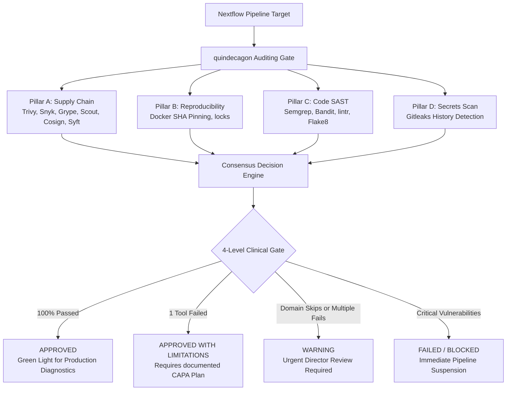
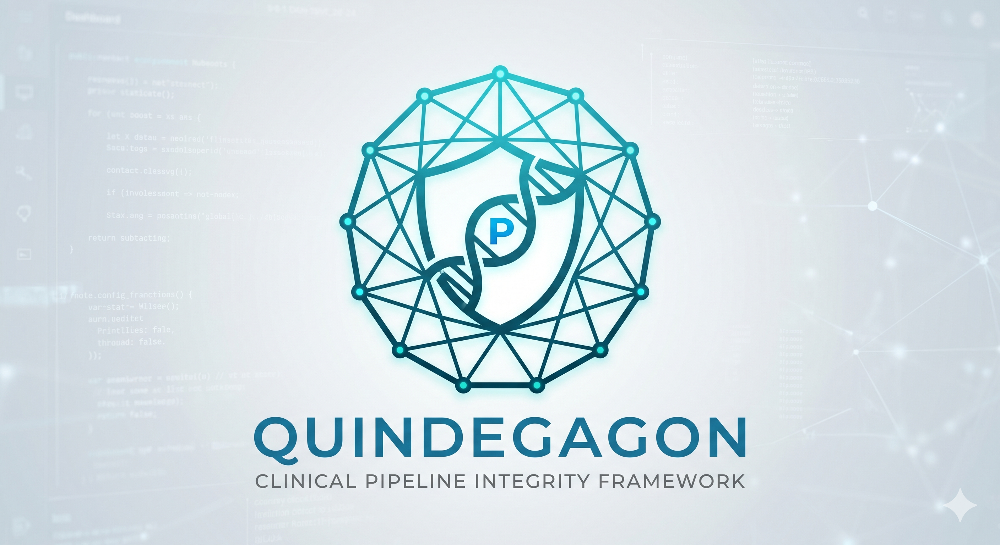

---
hide:
  - navigation
  - toc
---

# quindecagon: Clinical Security Framework

Welcome to the official documentation for **quindecagon**—a comprehensive, containerized clinical-grade pipeline integrity, security assurance, and validation framework designed for <a href="https://www.cap.org/" target="_blank">CAP</a>/<a href="https://www.cms.gov/medicare/quality/clinical-laboratory-improvement-amendments" target="_blank">CLIA</a>/<a href="https://www.hhs.gov/hipaa/index.html" target="_blank">HIPAA</a>-regulated environments.

Unlike generic enterprise security tools which are blind to complex bioinformatics workflows, **quindecagon** sits directly at the intersection of data science, cryptography, and clinical governance. It synthesizes telemetries from **15 specialized defensive checkers** to guarantee the complete stability, reproducibility, and compliance of Nextflow genomic analysis pipelines.

## Key Framework Pillars

quindecagon is built around four fundamental security domains matching molecular pathology best-practices:

- **Pillar A: Software Supply Chain Verification**: Implements cryptographic signature checking (`Cosign`), Software Bill of Materials (SBOM) generation (`Syft`), and SCA vulnerability mapping (`Grype`, `Trivy`, `Snyk`, `Docker Scout`) to prevent dependency-chain hijacking and detect third-party library exposures.
- **Pillar B: Workflow Reproducibility**: Verifies locked Docker SHA image digests and pins channel tags to eliminate container drift and mathematically guarantee the end-to-end determinism of diagnostics runs.
- **Pillar C: Script SAST & Code Quality**: Audits custom Python data-processing helpers, Nextflow orchestrations, and R statistics code using static analysis linting engines (`Semgrep`, `Bandit`, `Flake8`, `lintr`, `riskmetric`) to flag insecure functions, memory leaks, and command-injection patterns before diagnostic runs.
- **Pillar D: Secrets Protection**: Runs local-first deep repository scanners (`Gitleaks`) to detect and block hardcoded API tokens, SSH keys, or server credentials in repository histories, protecting ePHI data vectors.

## Defensive Architecture Overview

quindecagon implements a hardened, layered security orchestration where check results are parsed in real-time, mapped to clinical laboratory accreditation checklist requirements, and evaluated through a dynamic compliance gatekeeper:

## Premium Visual Delivery

Every audit run deterministic compiles two highly aesthetic, readable compliance deliverables:

1.  **Quarto PDF Document**: A formal, typeset clinical certification report suitable for submitting to CAP/CLIA auditors, styled using tcolorbox matrices and complete regulatory citations.
2.  **HTML Interactive Cockpit**: A single-screen, modern, semi-transparent dashboard built with custom glassmorphic styling, containing a live dark-themed raw telemetry log explorer for forensic investigations.

## Credits

**quindecagon** was originally written by **Jyotirmoy Das** ([@JD2112](https://github.com/JD2112)) at the Bioinformatics Core Facility, BKV, Linköping University.

Maintenace is now lead by Jyotirmoy Das.

Main developer:

- [Jyotirmoy Das](https://github.com/JD2112)

## Acknowledgements

We thank the **Core Facility of Linköping University** and **Clinical Genomics Linköping, SciLifeLab** for their support.

## Run with

## Stats

  
--stars

  
--open issues

  
--last release

  
--last update

## Included Tools

  
  
  
  
  
  
  
  
  
  
  
  
  
  
  

## Contributors

  <!-- Dynamically populated from GitHub API -->

## Get Help

- [GitHub Issues](https://github.com/JD2112/milou/issues)

